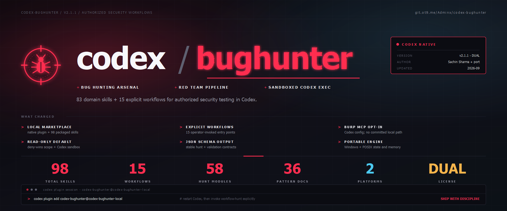

# Codex BugHunter



Codex-native fork of [Claude-BugHunter](https://github.com/elementalsouls/Claude-BugHunter).
It packages the upstream security methodology as a Codex plugin, with 83 domain
skills and 15 explicit workflow skills. The workflows stay opt-in, and the
optional automation engine runs through `codex exec`.

Use it only on systems you own or are explicitly authorized to test. Scope is
default-deny and out-of-scope rules always win.

## Install

Requirements: Codex CLI 0.145.0 or newer and Python 3.9 or newer.

Checkout install from this repository:

```powershell
pwsh ./plugins/codex-bughunter/scripts/install.ps1
python -m pip install -e ./plugins/codex-bughunter
```

```sh
sh ./plugins/codex-bughunter/scripts/install.sh
python3 -m pip install -e ./plugins/codex-bughunter
```

Pinned Git tag install and branch-tracking update live in
[plugins/codex-bughunter/INSTALL.md](plugins/codex-bughunter/INSTALL.md). Re-running
either installer now refreshes `codex-bughunter@codex-bughunter-local` safely after
checkout updates.

Restart Codex after installation. Invoke workflows explicitly:

```text
$codex-bughunter:workflow-scope https://target.example
$codex-bughunter:workflow-recon target.example --scope-file ./scope.json
$codex-bughunter:workflow-hunt https://target.example
```

The `cbh` CLI supports deterministic recon, classification, triage, reporting,
scope checks, engagement initialization, the portable autopilot, and memory
maintenance:

```text
cbh init target.example --in-scope target.example --in-scope "*.target.example"
cbh scope https://api.target.example --scope-file target.example/scope.json
cbh autopilot --scope-file target.example/scope.json --mock
```

Burp MCP configuration is deliberately opt-in; no local path or credential is
committed. See [installation](plugins/codex-bughunter/INSTALL.md) and
[usage](plugins/codex-bughunter/USAGE.md).

## Layout

- `.agents/plugins/marketplace.json` — local Codex marketplace.
- `plugins/codex-bughunter/` — plugin, 98 skills, CLI, and engine.
- `other/Claude-BugHunter/` — read-only upstream source; ignored by this fork.

Upstream attribution and licenses are preserved in `UPSTREAM.md`, `LICENSE`,
`LICENSE-CONTENT`, and `NOTICE` inside the plugin.
